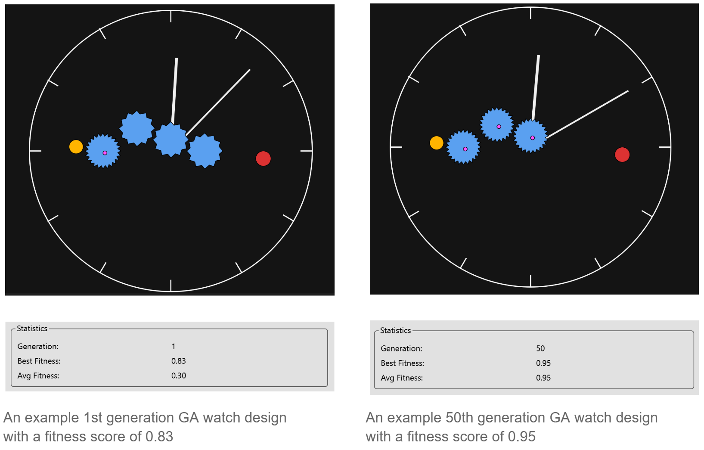
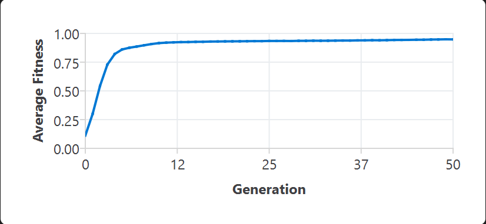

# Evolutionary Watches
**Using Genetic Algorithm to Create Watches from Scratch** 
**利用遗传算法从零开始设计手表**

> An Object-Oriented Genetic Algorithm built in C++ and Qt to simulate and evolve mechanical watch movements.

## Overview
WatchGA is a computational physics and evolutionary biology simulator designed to autonomously engineer mechanical watch gear trains. Starting from a randomized pool of physical components (gears, springs, balance wheels, and synthetic ruby jewels), the engine applies simplified physics constraints to evaluate structural integrity and kinetic efficiency. Over 50 generations, the algorithm naturally discovers real-world watchmaking principles, such as the 17-jewel friction-reduction standard and optimal gear ratio modules, without human intervention.

## Key Features
* **Strict MVC Architecture:** The heavy C++ mathematics engine is 100% decoupled from the UI. Data is transmitted to the rendering engine via lightweight Data Transfer Objects (DTOs) for safe, multi-threaded 60 FPS rendering.
* **Object-Oriented Composition:** Employs deeply nested hierarchical structures managed by C++ Smart Pointers (`std::unique_ptr`, `std::shared_ptr`). Components physically "own" their sub-parts (e.g., a Gear owns its Jewel bearing), preventing memory leaks and enforcing 1-to-1 physical constraints at the memory level.
* **Continuous Quadratic Penalties:** Replaces binary pass/fail fitness checks with continuous polynomial scaling. The AI is smoothly penalized for unmachinable gear modules (< 0.08mm) or destructive kinetic "knocking" (> 315° amplitude).
* **RAII Binary Serialization:** Full capability to pause, save, and load complex, deeply-nested polymorphic genomes directly from memory to the hard drive via binary file streams.

## The Genetic Algorithm

The evolutionary engine is highly modular, allowing users to hot-swap selection, crossover, and mutation strategies on the fly. It utilizes a continuous evaluation system to naturally guide the randomly generated chaos of Generation 0 toward chronometer-grade horology. 

**Selection Strategies**
* **Roulette Wheel Selection:** Selects parent watches with a probability directly proportional to their fitness scores.
* **Tournament Selection:** Randomly pits a configurable subset of watches against each other, selecting the most robust survivor to pass on its DNA.

**Crossover (Mating) Strategies**
* **One-Point Crossover:** Slices the component arrays of two parent watches at a random pivot, combining the first half of Parent A with the second half of Parent B.
* **Uniform Crossover:** Iterates through every genetic slot and flips a 50/50 coin to decide which parent contributes the component, ensuring a highly diverse mixing of traits.

**Mutation Strategies**
* **Parameter Nudge Mutation:** Acts as an evolutionary "cosmic ray," making micro-adjustments to physical properties. It might shave down a gear tooth, tweak a spring's elasticity, or even trigger spontaneous generation (or deletion) of synthetic ruby cap jewels inside gears.
* **Topological Swap Mutation:** Focuses purely on the structural arrangement. It randomly severs or bridges mechanical connections between existing parts without altering the physical parts themselves.
* **Add/Remove Mutation (Genome Sizing):** Prevents the algorithm from being locked into a fixed scope. It can dynamically spawn new, fully randomized gears into the assembly or destructively prune inefficient ones.

**The Physics Engine (Fitness Evaluator)**
* **Organ Ratios:** A structurally viable watch must spawn with exactly 1 balance wheel, 1 mainspring, 1 hairspring, 2 hands (hour/minute), and at least 1 transmission gear. Any deviation results in instant evolutionary death (Fitness = 0.0).
* **Continuous Quadratic Penalties:** Implements smooth polynomial drops to guide the AI away from impossible physics rather than using rigid binary pass/fail states. Penalties are heavily applied for "knocking" (amplitudes exceeding 315°), unmachinable micro-gears, or hands that scrape the physical case bounds.
* **Torque Optimization:** Evaluates the kinetic transfer penalty of the gear train. It applies massive rewards for discovering the "Horological Goldilocks Zone" (3 to 5 gears) and penalizes systems that sap energy through over-engineered, high-friction transmission lines.

**Elitism**
* Guarantees that a configurable number of the absolute best-performing watches bypass crossover and mutation entirely, carrying their pristine DNA directly into the next generation to prevent regression.

## Average Results & Evolutionary Trajectory
Across standard 50-generation test runs (Population: 125), the algorithm reliably exhibits a distinct, two-phase evolutionary timeline:

* **Generation 0 (The Chaos Phase):** Randomly generated populations exhibit high infant lethality (Average Fitness: ~0.3 vs. Best Fitness: ~0.85). Early watches feature chaotic, high-friction gear trains (10–14 parts) that struggle to transfer power.
* **Generation 15–25 (The Great Pruning):** The algorithm learns that excess transmission gears sap energy via friction penalties. The population genetically converges on a strict **8-part architecture** (5 core organs + exactly 3 gears)—mathematically proving the real-world optimum for minimalist torque transfer.
* **Generation 50 (Chronometer Convergence):** With the structure locked, the AI shifts to parameter polishing. Average Fitness skyrockets to tightly track the Best Fitness (>0.94 Avg / >0.95 Best). Final watches routinely hit metallurgical limits, demonstrate selective Cap Jewel placement to reduce friction, and perfectly size gear modules to achieve a chronometer-grade balance wheel amplitude of ~215° to 280°.

## Tech Stack
* **Language:** C++14 (Extensive use of `<memory>`, `<random>`, and RTTI)
* **Frontend:** Qt Framework 6.x (`QGraphicsScene`, `QCharts`)
* **Build System:** CMake / QMake
